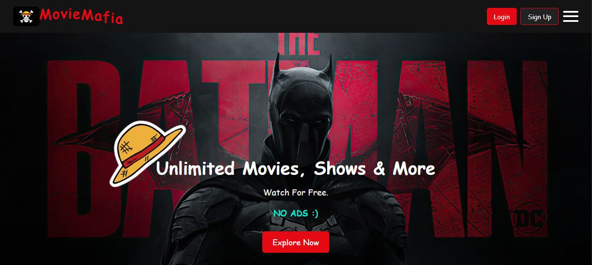

# MovieMafia.in

> A static movie streaming landing page built with HTML, CSS, and JavaScript as part of the FSJ (Full Stack Java) Programming course.

---



## About the Project

**MovieMafia.in** is a Netflix-inspired static website that simulates a movie streaming platform. It features a responsive layout, animated UI elements, a movie showcase grid, user authentication modals (Login & Sign Up), and a movie search bar. The project demonstrates front-end web development skills including DOM manipulation, form validation, and responsive design.

---

## Features

- **Animated Header** — Animated "MovieMafia" branding with a logo.
- **Hamburger Side Menu** — Responsive navigation with slide-in side menu.
- **Hero Section** — Full-width promotional banner with an "Explore Now" CTA button.
- **Movie Search** — Search bar to look up movies by name.
- **Movie Grid** — Showcase cards for featured titles (One Piece, Wednesday, Loki).
- **Login Modal** — Email & password login form with validation.
- **Sign Up Modal** — Registration form with name, email, mobile, and password fields.
- **Multiple Experiment Pages** — Links to `exp6.html` and `exp7.html` for additional experiments.
- **Fully Static** — No backend or external dependencies; runs directly in the browser.

---

## Tech Stack

| Technology | Purpose |
|---|---|
| HTML5 | Page structure and layout |
| CSS3 | Styling, animations, responsive design |
| JavaScript (Vanilla) | DOM manipulation, form validation, interactivity |

---

## Project Structure

```
Website-FSJ-/
├── index.html       # Main landing page (MovieMafia.in)
├── exp6.html        # Experiment 6 page
├── exp7.html        # Experiment 7 page
├── style.css        # Global stylesheet
├── script.js        # JavaScript logic (modals, validation, search)
├── images/          # All image assets (posters, logo, etc.)
│   ├── flag.png
│   ├── hat1.jpg
│   ├── poster1.jpg
│   ├── poster2.jpeg
│   └── poster3.jpeg
└── README.md        # Project documentation
```

---

## Getting Started

No installation or build tools required. Just open the project in your browser.

### Steps

1. **Clone the repository**
   ```bash
   git clone https://github.com/meet0411/Website-FSJ-.git
   ```

2. **Navigate into the folder**
   ```bash
   cd Website-FSJ-
   ```

3. **Open in browser**
   ```bash
   # Simply open index.html in any modern browser
   open index.html
   ```

---

## Pages Overview

### `index.html` — Main Page
The primary landing page featuring the hero section, movie grid, search functionality, and login/signup modals.

### `exp6.html` — Experiment 6
An additional experiment page accessible from the main page.

### `exp7.html` — Experiment 7
Another experiment page accessible from the main page.

---

## Team Members

| Name | Role |
|---|---|
| Meet Agrawal | Developer |
| Pranav Bhat | Developer |
| Ishan Chand | Developer |
| Varun Baliharia | Developer |

---

## Subject

**FSJ Programming** (Full Stack Java)
This project was developed as part of the FSJ Programming course to apply and demonstrate full-stack web development principles using core front-end technologies.

---

## License

This project is for educational purposes only.
© 2025 FullStackJava. All rights reserved.
